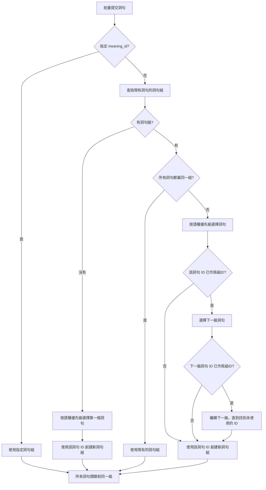

# 詞句與語義多對多關係設計

## System Reminder

**設計來源**：基於用戶需求，改造現有數據結構以支持多對多關係

**實現狀態**：
- ✅ 設計文檔已完成
- ⏳ 等待實現

---

## 概述

當前系統中，`expressions` 表通過 `meaning_id` 字段實現詞句與語義的關聯，但這種方式只支持單一語義關聯。爲了支持一個詞句對應多個語義，以及一個語義對應多個詞句的多對多關係，需要引入新的數據模型。

## 需求分析

### 當前問題
- 每個 expression 只能關聯一個 meaning（通過 `meaning_id` 字段）
- 無法表達一個詞句的多個不同語義（例如中文的"意思"可以表示"meaning"、"interesting"等）
- 無法爲多個詞句共享相同的語義定義

### 新需求
- **多對多關係**：一個 expression 可以有多個 meanings，一個 meaning 可以關聯多個 expressions
- **語義獨立性**：meanings 作爲獨立實體，有簡單的創建時間追蹤
- **兼容性考慮**：需要考慮現有數據的遷移方案

## 數據模型設計

### 1. meanings 表

存儲語義定義的獨立表。

```sql
CREATE TABLE IF NOT EXISTS meanings (
    id INTEGER PRIMARY KEY NOT NULL,
    created_by TEXT,
    created_at TEXT DEFAULT CURRENT_TIMESTAMP
);
```

**字段說明**：
- `id`: 主鍵，使用第一個關聯的 expression 的 id 作爲 meaning 的 id


### 2. expression_meaning 表

詞句與語義的多對多關聯表。

```sql
CREATE TABLE IF NOT EXISTS expression_meaning (
    id TEXT PRIMARY KEY NOT NULL,                 -- 使用 "expression_id-meaning_id" 格式
    expression_id INTEGER NOT NULL,                 -- 關聯 expressions.id
    meaning_id INTEGER NOT NULL,                    -- 關聯 meanings.id
    created_at TEXT DEFAULT CURRENT_TIMESTAMP,
    FOREIGN KEY (expression_id) REFERENCES expressions(id),
    FOREIGN KEY (meaning_id) REFERENCES meanings(id)
);
```

**字段說明**：
- `id`: 主鍵，使用 `"expression_id-meaning_id"` 格式（例如 `"123-456"`），確保唯一性
- `expression_id`: 關聯到 expressions 表
- `meaning_id`: 關聯到 meanings 表

**索引**：

```sql
CREATE INDEX IF NOT EXISTS idx_expression_meaning_expression_id ON expression_meaning(expression_id);
CREATE INDEX IF NOT EXISTS idx_expression_meaning_meaning_id ON expression_meaning(meaning_id);
```

### 3. expressions 表的修改

保留 `meaning_id` 字段以保持向後兼容，但不再作爲主要的語義關聯方式。

```sql
-- expressions 表保持不變，但 meaning_id 字段標記爲 deprecated
-- 新代碼應使用 expression_meaning 表進行關聯
```

## 數據庫關係圖

```
languages (語言表)
  ↓ 1:N
expressions (詞句表)
  ↔ N:M
expression_meaning (關聯表)
  ↔ N:1
meanings (語義表)

expressions (詞句表)
  ↓ 1:N
expression_versions (版本歷史表)
```

## 數據遷移方案

### 遷移策略

1. **創建新表**：創建 `meanings` 和 `expression_meaning` 表
2. **數據遷移**：
   - 從 `expressions` 表中讀取所有有 `meaning_id` 的記錄
   - 爲每個 `meaning_id` 創建對應的 `meanings` 記錄（使用 meaning_id 作爲 id）
   - 創建 `expression_meaning` 關聯記錄
3. **保留舊字段**：`expressions.meaning_id` 字段保留，但標記爲 deprecated
4. **代碼適配**：更新 API 和查詢邏輯以使用新的多對多關係

### 遷移腳本

遷移腳本將創建爲 `scripts/025_meaning_mapping.sql`，包含以下內容：

```sql
-- LangMap Meaning Mapping - 多對多關係改造
-- Date: 2026-03-04
-- Description: 添加 meanings 和 expression_meaning 表，支持詞句與語義的多對多關係
-- 執行：npx wrangler d1 execute langmap --remote --file=../scripts/025_meaning_mapping.sql --y

--------------------------------------------------------------------------------
-- 1. 創建 meanings 表
--------------------------------------------------------------------------------
CREATE TABLE IF NOT EXISTS meanings (
    id INTEGER PRIMARY KEY NOT NULL,
    created_by TEXT,
    created_at TEXT DEFAULT CURRENT_TIMESTAMP
);

--------------------------------------------------------------------------------
-- 2. 創建 expression_meaning 表
--------------------------------------------------------------------------------
CREATE TABLE IF NOT EXISTS expression_meaning (
    id INTEGER PRIMARY KEY NOT NULL,
    expression_id INTEGER NOT NULL,
    meaning_id INTEGER NOT NULL,
    created_at TEXT DEFAULT CURRENT_TIMESTAMP,
    UNIQUE(expression_id, meaning_id),
    FOREIGN KEY (expression_id) REFERENCES expressions(id),
    FOREIGN KEY (meaning_id) REFERENCES meanings(id)
);

--------------------------------------------------------------------------------
-- 3. 數據遷移：將現有的 meaning_id 遷移到新的多對多關係
--------------------------------------------------------------------------------

-- 步驟 3.1: 爲每個唯一的 meaning_id 創建 meanings 記錄
-- 使用 meaning_id 作爲 meanings.id，使用關聯的表達式文本和語言作爲語義內容
INSERT INTO meanings (id, created_by, created_at)
SELECT DISTINCT
    e.meaning_id,
    (SELECT created_by FROM expressions WHERE id = e.meaning_id),
    (SELECT created_at FROM expressions WHERE id = e.meaning_id)
FROM expressions e
WHERE e.meaning_id IS NOT NULL
AND NOT EXISTS (SELECT 1 FROM meanings WHERE id = e.meaning_id);

-- 步驟 3.2: 創建 expression_meaning 關聯記錄
-- 爲每個有 meaning_id 的 expression 創建關聯
INSERT INTO expression_meaning (id, expression_id, meaning_id, created_at)
SELECT
    -- 使用拼接的 ID 格式：expression_id-meaning_id
    e.id || '-' || e.meaning_id,
    e.id,
    e.meaning_id,
    CURRENT_TIMESTAMP
FROM expressions e
WHERE e.meaning_id IS NOT NULL
AND NOT EXISTS (
    SELECT 1 FROM expression_meaning em
    WHERE em.expression_id = e.id AND em.meaning_id = e.meaning_id
);

--------------------------------------------------------------------------------
-- 4. 創建索引
--------------------------------------------------------------------------------

-- expression_meaning 表索引
CREATE INDEX IF NOT EXISTS idx_expression_meaning_expression_id ON expression_meaning(expression_id);
CREATE INDEX IF NOT EXISTS idx_expression_meaning_meaning_id ON expression_meaning(meaning_id);
```

**遷移說明**：
- 遷移腳本會爲每個現有的 `meaning_id` 創建對應的 `meanings` 記錄
- 使用 `meaning_id` 作爲 `meanings.id`，保持與現有數據的關聯
- meanings 表僅保留必要的元數據（id, created_by, created_at）
- `expression_meaning.id` 使用 `"expression_id-meaning_id"` 格式（例如 `"123-456"`），確保唯一性且避免 ID 衝突
- 使用 `NOT EXISTS` 確保數據不重複

## API 設計

考慮到 meanings 表的極簡設計（只有 id, created_by, created_at），以及現有的 API 模式，我們通過擴展現有接口來實現多對多關係，儘量減少新增 API。

### 核心設計原則

**語義關聯自動化**：系統通過智能決策自動處理詞句與語義的多對多關聯，用戶無需手動管理複雜的關聯關係。

### 1. 獲取詞句詳情（擴展）

**Endpoint**: `GET /api/v1/expressions/:expr_id`

**變化**：返回數據中增加 `meanings` 字段，包含該詞句關聯的所有語義 ID。

**Response**:
```json
{
    "id": 123,
    "text": "hello",
    "language_code": "en-US",
    "meaning_id": 456,
    "meanings": [
        {
            "id": 456,
            "created_by": "user123",
            "created_at": "2026-03-04T00:00:00Z"
        }
    ]
}
```

### 2. 獲取詞句列表（擴展）

**Endpoint**: `GET /api/v1/expressions`

**Query Params**:
- `meaning_id`: (可選) 按語義 ID 篩選詞句（現有參數，支持多個用逗號分隔）
- `include_meanings`: (可選) 是否包含關聯的語義列表，默認 false

**變化**：當 `include_meanings=true` 時，返回的每個 expression 包含 `meanings` 字段。

### 3. 批量提交詞句（擴展核心接口）

**Endpoint**: `POST /api/v1/expressions/batch`

**核心變化**：擴展現有的智能語義錨點決策邏輯，支持多對多關係。

**Body**:
```json
{
    "meaning_id": 456
}
```

**參數說明**：
- `meaning_id`: (可選) 指定要關聯的語義 ID
  - 如果不指定，系統會自動決策
  - 如果指定，所有詞句都會關聯到這個語義

**自動決策邏輯**：

1. **情況1：所有詞句都沒有 meaning 關聯**
   - 按照語種優先級（en-GB > en-US > zh-TW > zh-CN > ...）選擇第一個詞句
   - 使用該詞句的 ID 作爲 meaning_id
   - 如果選中的詞句 ID 已經作爲 meaning_id 存在（衝突），則選擇下一級的詞句 ID
   - 所有詞句關聯到這個 meaning

2. **情況2：所有有 meaning_id 的詞句都有共同的 meaning_id**
   - 使用這個共同的 meaning_id
   - 沒有 meaning_id 的詞句也關聯到這個 meaning

3. **情況3：存在多個不同的 meaning_id**
   - 按照語種優先級選擇詞句作爲新的 meaning_id
   - 如果選中的詞句 ID 已經作爲 meaning_id 存在（衝突），則選擇下一級的詞句 ID
   - 所有詞句關聯到這個新的 meaning

**實現邏輯**：
```javascript
// 僞代碼：自動決策邏輯
function autoSelectMeaning(expressions) {
  // 步驟1: 批量查詢現有詞句的 meaning_id
  const existingExprs = await getExpressionsByIds(expressions.map(e => e.id));

  // 步驟2: 分析現有的 meaning_id 分布
  const meaningIds = existingExprs
    .filter(e => e.meaning_id !== null)
    .map(e => e.meaning_id);

  // 步驟3: 決策
  if (meaningIds.length === 0) {
    // 情況1: 都沒有 meaning_id，按語種優先級選擇
    const sortedExprs = sortByLanguagePriority(expressions);
    return sortedExprs[0].id; // 使用第一個詞句的 ID 作爲 meaning_id
  }

  const uniqueMeaningIds = [...new Set(meaningIds)];
  if (uniqueMeaningIds.length === 1) {
    // 情況2: 都有相同的 meaning_id
    return uniqueMeaningIds[0];
  }

  // 情況3: 存在多個不同的 meaning_id，按語種優先級選擇新的 meaning
  const sortedExprs = sortByLanguagePriority(expressions);

  // 檢查每個詞句 ID 是否已經是 meaning_id（衝突檢查）
  for (const expr of sortedExprs) {
    if (!uniqueMeaningIds.includes(expr.id)) {
      // 找到未作爲 meaning_id 的詞句，使用其 ID
      return expr.id;
    }
  }

  // 如果所有詞句 ID 都已經是 meaning_id（極端情況），選擇第一個詞句的 ID
  // 這意味着會創建新的 meanings 表記錄，即使 ID 已經存在
  return sortedExprs[0].id;
}
```

**Response**:
```json
{
    "success": true,
    "meaning_id": 456,
    "results": [...]
}
```

**與現有的 /expressions/associate 接口的關係**：
- `/expressions/batch` 的自動決策邏輯與 `/expressions/associate` 的 `selectSemanticAnchor` 方法類似
- 主要區別在於 `batch` 接口同時處理新詞句的創建和現有詞句的更新
- `associate` 接口只處理現有詞句的關聯更新

### 4. 關聯詞句與語義（新增，用於高級場景）

**Endpoint**: `POST /api/v1/expressions/:expr_id/meanings`

**用途**：爲已有詞句添加額外的語義關聯（多對多關係）

**Body**:
```json
{
    "meaning_id": 456
}
```

**Response**: Success message

### 5. 解除詞句與語義的關聯（新增，用於高級場景）

**Endpoint**: `DELETE /api/v1/expressions/:expr_id/meanings/:meaning_id`

**用途**：刪除詞句與特定語義的關聯

**Response**: Success message

## 設計說明

### 前端設計理念

**詞句組 vs 語義**

在 LangMap 的前端設計中，我們採用了"詞句組"的概念來代替抽象的"語義"：

| 概念 | 後端視角 | 前端視角 |
|------|----------|----------|
| 語義 | meanings 表 + expression_meaning 表 | 詞句組 |
| meaning_id | meanings.id | 詞句組 ID |
| 多對多關係 | 一個詞句可屬於多個 meanings | 一個詞句可屬於多個詞句組 |

**設計優勢**：

1. **直觀易懂**：用戶通過實際的詞句組理解語義關聯，而不是抽象的概念
2. **可視化強**：每個詞句組包含可見的詞句列表，用戶一目了然
3. **操作簡單**：通過"關聯詞句"按鈕，用戶可以直觀地將詞句添加到組
4. **漸進式**：普通用戶只需使用詞句組功能，高級用戶可以通過 API 直接操作語義

**交互設計原則**：

- **隱式關聯**：用戶不需要明確創建"語義"，而是通過批量提交詞句自動形成詞句組
- **顯式管理**：用戶可以在詞句詳情頁看到所有詞句組，並管理組內詞句
- **搜索關聯**：通過搜索功能找到詞句，然後將其關聯到現有詞句組
- **靈活組織**：一個詞句可以屬於多個詞句組，支持複雜的語義關係

### API 最小化原則

### 核心設計理念

**詞句組概念**：在前端中，"語義"不那麼明顯，通過"詞句組"來體現。每個 meaning_id 對應的一組詞句就是一個"詞句組"。

**用戶視角**：
- 用戶看到的不是"語義"，而是"詞句組"
- 每個詞句組包含共享相同含義的一組詞句
- 用戶可以通過"關聯詞句"按鈕將新的詞句添加到組中
- 用戶可以從組中移除詞句

**數據視角**：
- meanings 表只包含元數據（id, created_by, created_at）
- 語義的實際內容通過關聯的 expressions 體現
- 多個詞句可以屬於同一個詞句組（多對多關係）

### API 最小化原則

1. **核心自動化**：通過 `POST /api/v1/expressions/batch` 的自動決策邏輯，處理絕大多數場景
2. **手動管理**：僅在需要複雜多對多關係時，使用額外的關聯/解關聯接口
3. **語義通過詞句體現**：meanings 表只包含元數據，語義的實際內容通過關聯的 expressions 體現

### 與現有 API 的兼容性

1. **保留 meaning_id 字段**：expressions 表的 meaning_id 字段繼續保留，用於向後兼容和翻譯功能
2. **遷移腳本兼容**：數據遷移後，現有的基於 meaning_id 的查詢仍然有效
3. **漸進式升級**：前端可以選擇使用新的 meanings 數組字段，或者繼續使用 meaning_id 字段

### 查詢示例

```sql
-- 獲取詞句的所有語義（在 GET /api/v1/expressions/:id 中使用）
SELECT m.*
FROM meanings m
JOIN expression_meaning em ON m.id = em.meaning_id
WHERE em.expression_id = ?
ORDER BY em.created_at DESC;

-- 按語義查詢詞句（在 GET /api/v1/expressions 中使用，當 meaning_id 參數存在時）
SELECT DISTINCT e.*
FROM expressions e
JOIN expression_meaning em ON e.id = em.expression_id
WHERE em.meaning_id IN (?)
ORDER BY e.created_at DESC
LIMIT ? OFFSET ?;
```

## 前端實現

**設計理念**：語義在前端中不那麼明顯，通過"詞句組"的概念來體現。每個 meaning_id 對應的一組詞句就是一個"語義組"。

### 1. 詞句詳情頁

詞句詳情頁展示該詞句關聯的多個"詞句組"（即語義）：

- **詞句組列表**：展示該詞句所屬的所有詞句組
- **詞句組內容**：每個詞句組包含共享相同 meaning_id 的所有詞句
- **關聯詞句按鈕**：每個詞句組旁邊提供"關聯詞句"按鈕，用於將搜索到的詞句關聯到該語義
- **詞句組管理**：支持移除某個詞句從該組

**組件結構**：
```
ExpressionDetail
├── ExpressionCard (當前詞句基本信息)
├── ExpressionGroups (詞句組列表)
│   └── ExpressionGroup (單個詞句組)
│       ├── GroupHeader (組標識，如 "語義組 #456"）
│       ├── GroupExpressions (該組的所有詞句)
│       │   └── ExpressionCard (詞句卡片）
│       └── AssociateButton (關聯詞句按鈕）
└── AssociateModal (關聯詞句彈窗）
    ├── SearchBar (搜索詞句）
    ├── SearchResults (搜索結果）
    └── AssociateButton (確認關聯）
```

**交互流程**：

1. **查看詞句組**：用戶打開詞句詳情頁，看到該詞句所屬的所有詞句組
   ```javascript
   // 獲取詞句詳情（包含 meanings 數組）
   const response = await fetch(`/api/v1/expressions/${expressionId}`);
   const expression = await response.json();

   // meanings 數組中的每個 meaning_id 對應一個詞句組
   expression.meanings.forEach(async (meaning) => {
     // 獲取該語義組的所有詞句
     const groupResponse = await fetch(`/api/v1/expressions?meaning_id=${meaning.id}`);
     const groupExpressions = await groupResponse.json();

     // 渲染詞句組
     renderExpressionGroup({
       meaningId: meaning.id,
       expressions: groupExpressions
     });
   });
   ```

2. **關聯詞句到組**：點擊某個詞句組的"關聯詞句"按鈕
   ```javascript
   // 打開關聯彈窗，用戶搜索要關聯的詞句
   openAssociateModal({
     targetMeaningId: 456,  // 目標詞句組
     onSearch: async (query) => {
       // 搜索詞句
       const searchResponse = await fetch(`/api/v1/search?q=${query}&skip=0&limit=20`);
       return await searchResponse.json();
     },
     onAssociate: async (selectedExpressions) => {
       // 將選中的詞句關聯到目標詞句組
       const batchResponse = await fetch('/api/v1/expressions/batch', {
         method: 'POST',
         headers: {
           'Content-Type': 'application/json',
           'Authorization': `Bearer ${token}`
         },
         body: JSON.stringify({
           meaning_id: targetMeaningId,
           expressions: selectedExpressions.map(expr => ({
             id: expr.id,  // 已存在的詞句
             text: expr.text,
             language_code: expr.language_code
           }))
         })
       });

       const result = await batchResponse.json();
       showSuccess(`Successfully associated ${result.results.length} expressions to meaning #${targetMeaningId}`);

       // 刷新頁面
       reloadExpressionDetail();
     }
   });
   ```

3. **移除詞句從組**：點擊詞句旁邊的"移除"按鈕
   ```javascript
   async function removeFromGroup(expressionId, meaningId) {
     const response = await fetch(`/api/v1/expressions/${expressionId}/meanings/${meaningId}`, {
       method: 'DELETE',
       headers: {
         'Authorization': `Bearer ${token}`
       }
     });

     if (response.ok) {
       showSuccess('Expression removed from group');
       // 刷新頁面
       reloadExpressionDetail();
     }
   }
   ```

**界面示例**：

```
┌─────────────────────────────────────────────────┐
│ 詞句詳情: "hello" (en-US)                   │
├─────────────────────────────────────────────────┤
│                                             │
│ 詞句組 1 (3 個詞句) [關聯詞句 +]          │
│ ┌───────────────────────────────────────────┐  │
│ │ hello (en-US) [當前]                 │  │
│ │ 你好 (zh-CN)                         │  │
│ │ こんにちは (ja-JP) [移除]           │  │
│ └───────────────────────────────────────────┘  │
│                                             │
│ 詞句組 2 (2 個詞句) [關聯詞句 +]          │
│ ┌───────────────────────────────────────────┐  │
│ │ hi (en-US)                           │  │
│ │ 嗨 (zh-CN)                          │  │
│ └───────────────────────────────────────────┘  │
│                                             │
└─────────────────────────────────────────────────┘
```

### 2. 語義列表頁

### 2. 詞句列表頁

擴展現有的詞句列表頁，支持按詞句組（語義）篩選：

- **詞句組篩選**：通過 GET /api/v1/expressions?meaning_id=xxx 查詢特定詞句組的所有詞句
- **多組篩選**：通過逗號分隔的 meaning_id 參數查詢多個詞句組的詞句
- **包含詞句組信息**：通過 GET /api/v1/expressions?include_meanings=true 獲取詞句時同時加載其所屬的詞句組

**路由**：復用 `/expressions` 路由，增加篩選參數

**組件結構**：
```
ExpressionsPage
├── SearchBar (搜索和篩選)
│   └── GroupFilter (詞句組篩選器)
└── ExpressionsList
    └── ExpressionCard
        └── GroupsPreview (所屬詞句組預覽)
```

### 3. 批量提交詞句（核心功能）

在批量提交詞句時，利用系統的自動決策邏輯：

```javascript
// 場景1: 不指定 meaning_id，系統自動決策
const response1 = await fetch('/api/v1/expressions/batch', {
  method: 'POST',
  headers: {
    'Content-Type': 'application/json',
    'Authorization': `Bearer ${token}`
  },
  body: JSON.stringify({
    expressions: [
      {
        text: 'hello',
        language_code: 'en-US'
      },
      {
        text: '你好',
        language_code: 'zh-CN'
      }
    ]
    // 不指定 meaning_id，系統會自動按語種優先級選擇
  })
})
// 響應: { success: true, meaning_id: 123, results: [...] }

// 場景2: 指定 meaning_id，所有詞句關聯到該語義
const response2 = await fetch('/api/v1/expressions/batch', {
  method: 'POST',
  headers: {
    'Content-Type': 'application/json',
    'Authorization': `Bearer ${token}`
  },
  body: JSON.stringify({
    meaning_id: 456,  // 明確指定
    expressions: [
      {
        text: 'hi',
        language_code: 'en-US'
      },
      {
        text: '嗨',
        language_code: 'zh-CN'
      }
    ]
  })
})
// 響應: { success: true, meaning_id: 456, results: [...] }

// 場景3: 自動決策選擇新的 meaning（有衝突的 meaning_id）
const response3 = await fetch('/api/v1/expressions/batch', {
  method: 'POST',
  headers: {
    'Content-Type': 'application/json',
    'Authorization': `Bearer ${token}`
  },
  body: JSON.stringify({
    expressions: [
      {
        id: 100,  // 已存在，meaning_id = 456
        text: 'hello',
        language_code: 'en-US'
      },
      {
        id: 101,  // 已存在，meaning_id = 789（衝突）
        text: 'world',
        language_code: 'en-US'
      },
      {
        id: 102,  // 已存在，沒有 meaning_id
        text: 'new',
        language_code: 'en-US'
      }
    ]
    // 沒有指定 meaning_id，且存在衝突
  })
})
// 響應: { success: true, meaning_id: 102, results: [...] }
// 系統選擇了沒有 meaning_id 的詞句（ID 102）作爲新的 meaning_id
```

### 4. 錯誤處理和用戶反饋

由於自動決策會處理所有情況，批量提交幾乎不會失敗。前端需要提供友好的成功反饋：

```javascript
// 批量提交示例
async function submitBatch(expressions, options = {}) {
  try {
    const body: any = { expressions };

    // 可選：用戶可以明確指定 meaning_id
    if (options.meaningId) {
      body.meaning_id = options.meaningId;
    }

    const response = await fetch('/api/v1/expressions/batch', {
      method: 'POST',
      headers: {
        'Content-Type': 'application/json',
        'Authorization': `Bearer ${token}`
      },
      body: JSON.stringify(body)
    });

    if (!response.ok) {
      const error = await response.json();
      showGenericError(error.error);
      return;
    }

    const data = await response.json();

    // 顯示成功信息，包含使用的 meaning_id（詞句組 ID）
    showSuccess({
      message: `Success! ${data.results.length} expressions processed.`,
      meaningId: data.meaning_id,
      meaningInfo: data.meaning_id === options.meaningId
        ? 'Used specified group'
        : 'Auto-selected group'
    });

    return data;
  } catch (error) {
    showGenericError('Network error. Please try again.');
    throw error;
  }
}

// 使用示例
// 自動決策（推薦）
await submitBatch(expressions);

// 明確指定 meaning_id（高級用戶）
await submitBatch(expressions, { meaningId: 456 });
```

### 5. 搜索和篩選

支持基於詞句組（語義）的搜索和篩選：

- **按詞句組篩選詞句**：在詞句列表頁，通過 `meaning_id` 參數篩選詞句
  ```javascript
  // 示例：查詢詞句組 ID 456 的所有詞句
  const response = await fetch('/api/v1/expressions?meaning_id=456&skip=0&limit=20')

  // 示例：查詢多個詞句組的詞句
  const response = await fetch('/api/v1/expressions?meaning_id=456,457,458&skip=0&limit=20')
  ```

- **包含詞句組信息**：在查詢詞句時，通過 `include_meanings=true` 參數同時加載其所屬的詞句組
  ```javascript
  // 示例：獲取詞句時同時加載其所屬的詞句組
  const response = await fetch('/api/v1/expressions?include_meanings=true&skip=0&limit=20')
  ```

- **詞句詳情頁的詞句組展示**：在詞句詳情頁，通過 `meanings` 數組展示該詞句所屬的所有詞句組，每個組包含共享相同 meaning_id 的所有詞句

## 性能優化

### 1. 查詢優化

- 使用 `idx_expression_meaning_expression_id` 優化查詢詞句的所有語義
- 使用 `idx_expression_meaning_meaning_id` 優化查詢語義的所有詞句
- 對於高頻查詢，利用現有的 `cacheMiddleware` 緩存

**優化示例**：
```sql
-- 查詢詞句的所有語義（在 GET /api/v1/expressions/:id 中使用）
SELECT m.*
FROM meanings m
JOIN expression_meaning em ON m.id = em.meaning_id
WHERE em.expression_id = ?
ORDER BY em.created_at DESC;

-- 按語義查詢詞句（在 GET /api/v1/expressions 中使用，當 meaning_id 參數存在時）
SELECT DISTINCT e.*
FROM expressions e
JOIN expression_meaning em ON e.id = em.expression_id
WHERE em.meaning_id IN (?)
ORDER BY e.created_at DESC
LIMIT ? OFFSET ?;
```

### 2. 批量操作

- 擴展現有的 `POST /api/v1/expressions/batch` 接口，支持批量關聯多個語義
- 使用批量插入語句減少數據庫往返

**批量關聯示例**：
```sql
-- 批量創建詞句與語義的關聯
INSERT OR IGNORE INTO expression_meaning (id, expression_id, meaning_id, created_at)
VALUES
  (?, ?, ?, CURRENT_TIMESTAMP),
  (?, ?, ?, CURRENT_TIMESTAMP);
```

### 3. 分頁查詢

- 詞句列表接口已支持分頁（`skip`, `limit` 參數）
- 語義關聯的詞句列表復用現有的分頁機制

## 向後兼容性

### 1. 保留舊字段

- `expressions.meaning_id` 字段保留，但標記爲 deprecated
- 在過渡期內，舊 API 繼續使用該字段

### 2. 漸進式遷移

- 新功能使用新的多對多關係
- 舊功能逐步遷移到新的數據模型

### 3. 數據一致性

- 在遷移期間，確保新舊數據模型的一致性
- 定期檢查和修復不一致的數據

### 4. API 兼容

```javascript
// 舊 API（保持兼容）
GET /api/v1/expressions/:id
// 返回 meaning_id（如果存在）

// 新 API
GET /api/v1/expressions/:id/meanings
// 返回所有語義的詳細信息
```

## 實施步驟

### 階段 1：數據庫設計
- ✅ 編寫設計文檔
- ⏳ 編寫遷移腳本（`scripts/025_meaning_mapping.sql`）
- ⏳ 在測試環境驗證遷移腳本

### 階段 2：後端實現
- ⏳ 擴展 DatabaseService，添加語義關聯查詢方法
- ⏳ 實現 `autoSelectMeaning` 方法：擴展現有的 `selectSemanticAnchor` 邏輯，支持多對多關係
- ⏳ 更新現有 API 路由：
  - `GET /api/v1/expressions/:expr_id`：增加 `meanings` 字段
  - `GET /api/v1/expressions`：增加 `include_meanings` 參數支持
- ⏳ 擴展 `POST /api/v1/expressions/batch`：實現自動決策邏輯
- ⏳ 新增 API 路由（高級功能）：
  - `POST /api/v1/expressions/:expr_id/meanings`
  - `DELETE /api/v1/expressions/:expr_id/meanings/:meaning_id`
- ⏳ 編寫單元測試

### 階段 3：前端實現
- ⏳ 擴展 Expression 詳情頁：展示和管理語義關聯
- ⏳ 擴展 Expressions 列表頁：支持語義篩選
- ⏳ 擴展批量提交功能：處理自動決策邏輯和展示結果
- ⏳ 更新 API Service 層

### 階段 4：測試和優化
- ⏳ 集成測試
- ⏳ 性能測試和優化
- ⏳ 數據驗證

### 階段 5：部署和監控
- ⏳ 數據庫遷移
- ⏳ 代碼部署
- ⏳ 監控和錯誤跟蹤

## 注意事項

1. **ID 生成策略**：meanings.id 使用第一個關聯的 expression 的 id，確保數據一致性
2. **詞句組概念**：前端通過"詞句組"來體現語義，每個 meaning_id 對應一個詞句組
3. **自動決策優先**：批量提交時優先使用自動決策邏輯，減少用戶操作複雜度
4. **向後兼容**：保留 expressions.meaning_id 字段，確保現有功能不受影響
5. **性能影響**：多對多關係會增加查詢複雜度，通過索引和緩存優化
6. **數據完整性**：確保外鍵約束和唯一性約束正確配置
7. **衝突處理**：自動選擇新的 meaning 時，如果詞句 ID 已作爲 meaning_id 存在，則按語種優先級選擇下一級詞句
8. **前端體驗**：用戶無需理解"語義"的抽象概念，通過"詞句組"的直觀界面進行操作

## 自動決策邏輯詳解

### 語種優先級

系統按照以下優先級選擇詞句組（meaning_id）：

```javascript
const LANGUAGE_PRIORITY = [
  'en-GB', 'en-US', 'zh-TW', 'zh-CN',
  'hi-IN', 'es-ES', 'fr-FR', 'ar-SA',
  'bn-IN', 'pt-BR', 'ru-RU', 'ur-PK',
  'id-ID', 'de-DE', 'ja-JP', 'ko-KR',
  'tr-TR', 'it-IT'
];
```

### 決策流程



### 與現有系統的集成

- **復用 `selectSemanticAnchor` 方法**：現有的 `/expressions/associate` 接口已經實現了類似的智能選擇邏輯
- **擴展到 batch 場景**：將相同的決策邏輯應用到批量提交接口
- **保持一致性**：確保批量提交和單個關聯的詞句組選擇策略一致

## 相關文檔

- [數據庫設計](./feat-database.md)
- [系統架構設計](../system/architecture.md)
- [後端 API 指南](../../api/backend-guide.md)
