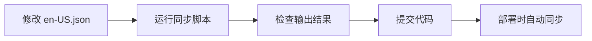

# UI 翻译同步系统设计文档

## 问题背景

当前系统中，翻译 key 的管理存在数据流断裂问题：

1. **静态 locales 文件**（`web/src/locales/en-US.json` 等）是前端 UI 翻译的权威来源
2. **数据库 expressions 表**通过 `langmap` 收藏集存储翻译
3. **缺失环节**：从 locales 文件到数据库没有自动同步机制
4. **结果**：开发者新增的翻译 key 在前端可见，但在翻译界面不可见

**具体表现**：每次在 `locales/en-US.json` 中新增翻译 key 后，线上用户翻译界面根本没有展示这些新 key，导致用户无法翻译新增内容。

---

## 系统架构回顾

### 当前翻译系统组成

```
┌─────────────────────────────────────────────────────────────────┐
│                        前端 (Vue + Vue I18n)                      │
└─────────────────────────────────────────────────────────────────┘
                              │
                              ▼
┌─────────────────────────────────────────────────────────────────┐
│  1. 静态文件加载                                                 │
│     └── 8种核心语言: en-US, zh-CN, zh-TW, es, fr, ja, nan-TW, yue-HK │
│     └── 直接从 /web/src/locales/*.json 导入                        │
│                                                                  │
│  2. 动态加载 (其他语言)                                            │
│     └── i18n.js: loadLanguage(languageCode)                       │
│         ├── 检查缓存                                              │
│         ├── 调用 API: GET /api/v1/ui-translations/{lang}          │
│         └── 转换并设置到 i18n 实例                                  │
└─────────────────────────────────────────────────────────────────┘
                              │
                              ▼
┌─────────────────────────────────────────────────────────────────┐
│                      后端 API (Hono)                          │
└─────────────────────────────────────────────────────────────────┘
                              │
                              ▼
┌─────────────────────────────────────────────────────────────────┐
│  GET /api/v1/ui-translations/{language}                           │
│  └── 查询 "langmap" 收藏集中的翻译                                  │
│                                                                  │
│  POST /api/v1/ui-translations/{language}                          │
│  └── 批量保存用户翻译                                              │
└─────────────────────────────────────────────────────────────────┘
                              │
                              ▼
┌─────────────────────────────────────────────────────────────────┐
│                   Cloudflare D1 数据库                            │
│                                                                  │
│  expressions 表                                                   │
│  ├── id, text, language_code, meaning_id, tags                   │
│  ├── source_type, review_status, created_by, updated_by          │
│  └── 存储所有翻译文本（包括 UI 翻译和用户贡献的表达式）              │
│                                                                  │
│  collections 表                                                   │
│  └── 特殊收藏集 "langmap" 标识所有 UI 翻译                         │
└─────────────────────────────────────────────────────────────────┘
```

### 数据关联机制

- **meaning_id**：不同语言的翻译通过 meaning_id 关联到同一含义
- **对于 en-US**：meaning_id 就是其自身的 id
- **对于其他语言**：meaning_id 指向 en-US 的对应翻译 id
- **tags 字段**：存储本地化键（如 `["home.title"]`）

---

## 推荐解决方案

### ⭐ 方案零：前端直接显示本地 JSON（推荐首选）

**核心思路**：翻译界面直接读取本地 `locales/en-US.json` 文件作为参考语言，合并数据库中的目标语言翻译。

**优点**：
- **最简单**：无需后端同步，无需数据库操作
- **最快速**：立即可用，新增 key 自动显示
- **无风险**：不修改数据库，不影响现有数据
- **易维护**：纯前端改动，逻辑清晰

**实现方式**：

修改 `web/src/pages/TranslateInterface.vue`：

```javascript
import enMessages from '../locales/en-US.json'

// 扁平化 en-US.json
const flattenObject = (obj, prefix = '') => {
  const flattened = {}
  for (const key in obj) {
    const newKey = prefix ? `${prefix}.${key}` : key
    if (typeof obj[key] === 'object' && obj[key] !== null) {
      Object.assign(flattened, flattenObject(obj[key], newKey))
    } else {
      flattened[newKey] = obj[key]
    }
  }
  return flattened
}

// 在组件加载时使用本地 en-US
const loadReferenceTranslations = () => {
  const flattened = flattenObject(enMessages)
  referenceTranslations.value = Object.entries(flattened).map(([key, text]) => ({
    key,
    text,
    meaning_id: key, // 使用 key 作为临时 meaning_id
    fromLocal: true  // 标记来源
  }))
}
```

**数据流**：

```
┌─────────────────────────────────────────────────────────────┐
│  翻译界面加载                                                 │
└─────────────────────────────────────────────────────────────┘
                            │
                            ▼
┌─────────────────────────────────────────────────────────────┐
│  参考语言（en-US）                                            │
│  ├── 直接读取本地 locales/en-US.json                        │
│  └── 扁平化为 key-value 列表                                  │
└─────────────────────────────────────────────────────────────┘
                            │
                            ▼
┌─────────────────────────────────────────────────────────────┐
│  目标语言                                                     │
│  └── 从数据库获取：GET /ui-translations/{targetLang}         │
└─────────────────────────────────────────────────────────────┘
                            │
                            ▼
┌─────────────────────────────────────────────────────────────┐
│  合并显示                                                     │
│  ├── 以本地 en-US key 为基准                                  │
│  ├── 匹配数据库中的目标语言翻译（按 key / meaning_id）        │
│  └── 未翻译的显示为空                                         │
└─────────────────────────────────────────────────────────────┘
```

**保存逻辑调整**：

保存时需要为新 key 生成 meaning_id：

```javascript
const saveTranslations = async () => {
  const toSave = []

  for (const item of mergedTranslations.value) {
    if (item.targetText && item.targetText !== item.originalTargetText) {
      // 如果是新增 key，先生成 meaning_id
      const meaningId = item.meaning_id || await generateMeaningId(item.key, item.referenceText)

      toSave.push({
        key: item.key,
        text: item.targetText,
        meaning_id: meaningId
      })
    }
  }

  await saveUITranslations(targetLanguage.value, toSave)
}

// 为本地 key 生成 meaning_id
const generateMeaningId = async (key, text) => {
  // 检查数据库是否已有对应的 en-US 表达式
  const existing = await api.get(`/expressions/by-key?key=${key}&lang=en-US`)

  if (existing.data) {
    return existing.data.meaning_id
  }

  // 如果没有，创建新的 en-US 表达式作为参考
  const created = await api.post('/expressions', {
    text,
    language_code: 'en-US',
    tags: JSON.stringify([key]),
    meaning_id: null // 会自动设置为 id
  })

  return created.data.meaning_id
}
```

**关键文件**：
- `web/src/pages/TranslateInterface.vue` - 主要修改文件
- 可能需要添加 `GET /api/v1/expressions/by-key` API

---

### 其他方案

如果需要将数据持久化到数据库，可以考虑以下方案：

#### 方案一：Python 脚本同步

**适用场景**：需要将本地 locales 同步到数据库

**文件**：`scripts/009_sync_locales_to_db.py`

#### 方案二：TypeScript 服务 + API 端点

**适用场景**：需要通过 API 触发同步，集成到 CI/CD

**文件**：`backend/src/server/services/LocaleSyncService.ts`

#### 方案三：构建时自动同步

**适用场景**：完全自动化同步流程

详见下文详细设计。

---

## 管理员同步功能

### 功能描述

在翻译界面添加一个**同步按钮**，仅管理员可见。点击后会将本地 JSON 文件中的翻译同步到远程数据库：
- **新增**：数据库中不存在的 key 会被创建
- **忽略**：数据库中已存在的 key 不会被覆盖（保持数据安全）

### 设计考虑

1. **权限控制**：仅管理员可见同步按钮
2. **幂等性**：多次同步不会产生重复数据
3. **安全性**：不覆盖已有翻译，避免误操作
4. **反馈**：显示同步进度和结果统计

### 数据流

```
┌─────────────────────────────────────────────────────────────┐
│  管理员点击"同步"按钮                                        │
└─────────────────────────────────────────────────────────────┘
                            │
                            ▼
┌─────────────────────────────────────────────────────────────┐
│  前端收集本地 JSON 数据                                      │
│  ├── 遍历所有本地 locales 文件                               │
│  ├── 扁平化嵌套结构                                          │
│  └── 按语言分组                                              │
└─────────────────────────────────────────────────────────────┘
                            │
                            ▼
┌─────────────────────────────────────────────────────────────┐
│  调用同步 API                                               │
│  POST /api/v1/sync-locales                                   │
│  { languages: ['en-US', 'zh-CN', ...] }                     │
└─────────────────────────────────────────────────────────────┘
                            │
                            ▼
┌─────────────────────────────────────────────────────────────┐
│  后端处理                                                    │
│  ├── 检查用户权限（管理员）                                  │
│  ├── 对比本地数据和数据库                                    │
│  ├── 识别需要新增的 key                                      │
│  ├── 批量插入到数据库                                       │
│  └── 关联到 langmap 收藏集                                   │
└─────────────────────────────────────────────────────────────┘
                            │
                            ▼
┌─────────────────────────────────────────────────────────────┐
│  返回同步结果                                                │
│  {                                                          │
│    success: true,                                           │
│    results: {                                              │
│      'en-US': { added: 5, skipped: 100 },                  │
│      'zh-CN': { added: 3, skipped: 95 }                    │
│    }                                                        │
│  }                                                          │
└─────────────────────────────────────────────────────────────┘
```

### 前端实现

#### UI 组件

在 `TranslateInterface.vue` 中添加同步按钮：

```vue
<!-- 仅管理员可见 -->
<div v-if="isAdmin" class="mb-4 p-4 bg-yellow-50 border border-yellow-200 rounded">
  <div class="flex items-center justify-between">
    <div>
      <h3 class="text-lg font-semibold text-yellow-800">同步本地翻译</h3>
      <p class="text-sm text-yellow-700">
        将本地 JSON 文件中的新增翻译同步到数据库。已存在的翻译不会被覆盖。
      </p>
    </div>
    <button
      @click="syncLocales"
      :disabled="syncing"
      class="px-4 py-2 bg-yellow-600 text-white rounded hover:bg-yellow-700 disabled:bg-gray-400 disabled:cursor-not-allowed"
    >
      {{ syncing ? '同步中...' : '同步翻译' }}
    </button>
  </div>
  <!-- 同步结果 -->
  <div v-if="syncResult" class="mt-3 text-sm">
    <div v-for="(result, lang) in syncResult" :key="lang" class="mb-1">
      <span class="font-medium">{{ lang }}:</span>
      新增 {{ result.added }} 条，跳过 {{ result.skipped }} 条
    </div>
  </div>
</div>
```

#### 逻辑实现

```javascript
import { ref, computed } from 'vue'
import { useAuth } from '../composables/useAuth'

// 同步状态
const syncing = ref(false)
const syncResult = ref(null)

// 检查是否管理员
const { user } = useAuth()
const isAdmin = computed(() => user.value?.role === 'admin')

// 同步本地翻译到数据库
const syncLocales = async () => {
  if (!isAdmin.value) {
    alert('仅管理员可以执行此操作')
    return
  }

  syncing.value = true
  syncResult.value = null

  try {
    // 收集所有有本地文件的语言
    const languages = Object.keys(localMessages)

    // 调用同步 API
    const response = await api.post('/sync-locales', { languages })
    syncResult.value = response.data.results

    alert('同步完成！')

    // 重新加载翻译数据
    await loadTranslations()
  } catch (error) {
    console.error('同步失败:', error)
    alert('同步失败：' + (error.response?.data?.error || error.message))
  } finally {
    syncing.value = false
  }
}
```

### 后端实现

#### API 端点

在 `backend/src/server/api/v1.ts` 中添加：

```typescript
// POST /api/v1/sync-locales
api.post('/sync-locales', requireAdmin, async (c) => {
  try {
    const db = getDB(c)
    const { languages } = await c.req.json()

    if (!languages || !Array.isArray(languages)) {
      return c.json({ error: 'Invalid languages parameter' }, 400)
    }

    const results = {}

    // 为每种语言执行同步
    for (const langCode of languages) {
      results[langCode] = await syncLanguage(db, langCode)
    }

    return c.json({
      success: true,
      results
    })
  } catch (error: any) {
    console.error('Error in POST /sync-locales:', error)
    return c.json({ error: 'Failed to sync locales' }, 500)
  }
})
```

#### 同步逻辑

```typescript
interface SyncResult {
  added: number
  skipped: number
  errors: string[]
}

async function syncLanguage(db: D1Database, langCode: string): Promise<SyncResult> {
  const result: SyncResult = { added: 0, skipped: 0, errors: [] }

  try {
    // 1. 获取 langmap 收藏集 ID
    const langmapCol = await db.prepare(
      "SELECT id FROM collections WHERE name = 'langmap'"
    ).first<{ id: number }>()

    if (!langmapCol) {
      throw new Error('langmap collection not found')
    }

    // 2. 获取数据库中已有的 key
    const existing = await db.prepare(`
      SELECT e.tags
      FROM expressions e
      JOIN collection_items ci ON e.id = ci.expression_id
      WHERE ci.collection_id = ? AND e.language_code = ?
    `).bind(langmapCol.id, langCode).all<{ tags: string }>()

    const existingKeys = new Set()
    for (const item of existing.results || []) {
      try {
        const tags = JSON.parse(item.tags)
        if (Array.isArray(tags)) {
          tags.forEach(key => existingKeys.add(key))
        }
      } catch (e) {
        // 忽略解析错误
      }
    }

    // 3. 获取本地 JSON 数据（从前端传入或从文件系统读取）
    // 这里需要实现：从前端接收本地数据或从服务器文件系统读取
    const localData = await getLocalLocaleData(langCode)
    const flattened = flattenObject(localData)

    // 4. 同步新增的 key
    const batchValues = []
    const timestamp = new Date().toISOString()

    for (const [key, text] of Object.entries(flattened)) {
      if (existingKeys.has(key)) {
        result.skipped++
        continue
      }

      // 新增此 key
      const expressionId = stableHashId(`${text}|${langCode}`)
      const meaningId = langCode === 'en-US' ? expressionId : null
      const tags = JSON.stringify([key])

      batchValues.push({
        id: expressionId,
        text,
        language_code: langCode,
        meaning_id: meaningId,
        tags,
        source_type: 'system',
        review_status: 'approved',
        created_by: 'admin_sync',
        created_at: timestamp,
        updated_at: timestamp
      })

      result.added++
    }

    // 5. 批量插入
    if (batchValues.length > 0) {
      for (const item of batchValues) {
        await db.prepare(`
          INSERT OR IGNORE INTO expressions
          (id, text, meaning_id, language_code, tags, source_type, review_status, created_by, created_at, updated_at)
          VALUES (?, ?, ?, ?, ?, ?, ?, ?, ?, ?)
        `).bind(
          item.id, item.text, item.meaning_id, item.language_code,
          item.tags, item.source_type, item.review_status,
          item.created_by, item.created_at, item.updated_at
        ).run()

        // 关联到 langmap 收藏集
        await db.prepare(`
          INSERT OR IGNORE INTO collection_items (collection_id, expression_id, created_at)
          VALUES (?, ?, ?)
        `).bind(langmapCol.id, item.id, timestamp).run()
      }
    }

  } catch (error: any) {
    result.errors.push(error.message)
  }

  return result
}

// 工具函数：扁平化对象
function flattenObject(obj: any, prefix = ''): Record<string, string> {
  const flattened: Record<string, string> = {}
  for (const key in obj) {
    const newKey = prefix ? `${prefix}.${key}` : key
    if (typeof obj[key] === 'object' && obj[key] !== null) {
      Object.assign(flattened, flattenObject(obj[key], newKey))
    } else {
      flattened[newKey] = obj[key]
    }
  }
  return flattened
}

// 工具函数：生成稳定 ID
function stableHashId(content: string): number {
  let h = 0x811c9dc5
  for (let i = 0; i < content.length; i++) {
    h ^= content.charCodeAt(i)
    h = Math.imul(h, 0x01000193)
  }
  h = h >>> 0
  return (h % (2 ** 31 - 1)) + 1
}

// 获取本地 locale 数据
async function getLocalLocaleData(langCode: string): Promise<any> {
  // 方案1：从服务器文件系统读取（需要配置）
  // const fs = require('fs')
  // const path = require('path')
  // const filePath = path.join(__dirname, `../../web/src/locales/${langCode}.json`)
  // return JSON.parse(fs.readFileSync(filePath, 'utf-8'))

  // 方案2：从前端接收数据（推荐）
  // 需要前端将本地 JSON 数据发送到后端
  throw new Error('Implementation needed: getLocalLocaleData')
}
```

### 数据传递方案

#### 方案 A：前端发送本地数据（推荐）

**优点**：
- 无需后端访问前端文件系统
- 部署更简单

**实现**：

```javascript
// 前端
const syncLocales = async () => {
  const languages = Object.keys(localMessages)
  const localeData = {}

  // 收集所有本地数据
  for (const lang of languages) {
    localeData[lang] = localMessages[lang]
  }

  const response = await api.post('/sync-locales', {
    languages,
    localeData  // 发送本地数据
  })
}
```

```typescript
// 后端
async function syncLanguage(db: D1Database, langCode: string, localeData: any): Promise<SyncResult> {
  // 使用传入的 localeData，而不是从文件系统读取
  const flattened = flattenObject(localeData)
  // ... 其余逻辑
}
```

#### 方案 B：后端读取文件系统

**优点**：
- 前端不需要传输大量数据

**缺点**：
- 需要配置后端访问前端文件路径
- 部署时路径可能不同

### 权限控制

确保只有管理员可以执行同步操作：

```typescript
// 添加 requireAdmin 中间件
import { requireAuth } from './auth'

const requireAdmin = async (c: Context, next: Next) => {
  await requireAuth(c, next)

  const user = c.get('user')
  if (user.role !== 'admin') {
    return c.json({ error: 'Admin access required' }, 403)
  }
}

api.post('/sync-locales', requireAdmin, async (c) => {
  // ... 同步逻辑
})
```

### 用户体验

1. **确认对话框**：点击同步前确认操作
2. **进度显示**：显示正在同步的语言
3. **结果反馈**：清晰显示每种语言的新增/跳过数量
4. **错误处理**：显示详细的错误信息
5. **自动刷新**：同步完成后自动刷新翻译列表

### 安全考虑

1. **权限验证**：仅管理员可执行
2. **幂等性**：多次同步结果一致
3. **不覆盖**：已有翻译不会被修改
4. **审计日志**：记录同步操作（谁、何时、结果）

---

## 详细设计

### 1. 架构设计

```
┌─────────────────────────────────────────────────────────────┐
│                     同步触发方式                              │
├─────────────────────────────────────────────────────────────┤
│  1. API 端点触发         2. CLI 命令        3. 构建时钩子    │
│  POST /api/v1/sync     npm run sync    npm run build       │
│  -locales              -locales          (自动)             │
└─────────────────────────────────────────────────────────────┘
                            │
                            ▼
┌─────────────────────────────────────────────────────────────┐
│                 核心同步服务                 │
├─────────────────────────────────────────────────────────────┤
│  1. 读取 en-US.json                                         │
│  2. 扁平化嵌套结构 (home.title → "home.title")             │
│  3. 对比数据库现有记录                                       │
│  4. 识别新增/修改/删除的 key                                │
│  5. 生成 SQL 批量操作                                       │
└─────────────────────────────────────────────────────────────┘
                            │
                            ▼
┌─────────────────────────────────────────────────────────────┐
│                    数据库操作策略                             │
├─────────────────────────────────────────────────────────────┤
│  • 新增 key: INSERT OR IGNORE (幂等性)                     │
│  • 修改 key: UPDATE text (保留 meaning_id)                  │
│  • 删除 key: 软删除 (标记废弃，不物理删除)                   │
│  • 关联 langmap 收藏集                                      │
└─────────────────────────────────────────────────────────────┘
```

### 2. 数据结构转换

#### 输入数据结构（en-US.json）
```json
{
  "home": {
    "title": "Connect All Languages",
    "subtitle": "Learn New Languages"
  }
}
```

#### 扁平化后的结构
```javascript
{
  "home.title": "Connect All Languages",
  "home.subtitle": "Learn New Languages"
}
```

#### 数据库记录结构
```sql
-- expressions 表
id: stable_hash_id("Connect All Languages|en-US")
text: "Connect All Languages"
language_code: "en-US"
tags: '["home.title"]'
meaning_id: id (对于 en-US，meaning_id = id)
source_type: "system"
review_status: "approved"
created_by: "system_sync"
```

---

## 实现方案

### 方案一：Python 脚本（推荐首选）

**文件**：`scripts/009_sync_locales_to_db.py`

**优点**：
- 可独立运行，不依赖后端服务
- 可生成 SQL 文件，便于审查和手动执行
- 利用现有 Python 基础设施
- 适合开发环境快速同步

**用法**：
```bash
# 生成 SQL 文件（不执行）
python3 scripts/009_sync_locales_to_db.py --dry-run

# 生成并执行 SQL
python3 scripts/009_sync_locales_to_db.py

# 删除数据库中多余的 key
python3 scripts/009_sync_locales_to_db.py --delete-missing
```

**实现要点**：
```python
def flatten_dict(d, parent_key='', sep='.'):
    """扁平化嵌套字典：{home: {title: "Hi"}} → {"home.title": "Hi"}"""
    items = []
    for k, v in d.items():
        new_key = f"{parent_key}{sep}{k}" if parent_key else k
        if isinstance(v, dict):
            items.extend(flatten_dict(v, new_key, sep=sep).items())
        else:
            items.append((new_key, v))
    return dict(items)

def generate_sync_sql(en_us_data):
    """生成同步 SQL"""
    flattened = flatten_dict(en_us_data)
    sql_statements = []

    for key, text in flattened.items():
        expression_id = stable_hash_id(f"{text}|en-US")
        tags = json.dumps([key])
        # 生成 INSERT OR IGNORE 语句
        sql_statements.append(f"...")

    return '\n'.join(sql_statements)
```

### 方案二：TypeScript 服务 + API 端点

**文件**：`backend/src/server/services/LocaleSyncService.ts`

**优点**：
- 集成到现有后端系统
- 支持 HTTP API 触发
- 适合 CI/CD 自动化

**用法**：
```bash
# 通过 API 触发同步
curl -X POST http://localhost:8787/api/v1/sync-locales \
  -H "Authorization: Bearer $TOKEN" \
  -d "dryRun=false&deleteMissing=false"

# 或使用 npm script
npm run sync-locales
```

**实现要点**：
```typescript
export class LocaleSyncService {
  async syncLocalesFromJSON(
    localesJson: Record<string, any>,
    options: {
      dryRun?: boolean
      deleteMissing?: boolean
      creator?: string
    } = {}
  ): Promise<SyncResult> {
    // 1. 扁平化 locales
    const flattened = this.flattenObject(localesJson)

    // 2. 获取现有记录
    const existing = await this.getExistingTranslations()

    // 3. 对比并识别变更
    const changes = this.detectChanges(flattened, existing)

    // 4. 批量执行数据库操作
    await this.applyChanges(changes, options)

    return result
  }

  private flattenObject(obj: any, prefix = ''): Record<string, string> {
    const flattened: Record<string, string> = {}
    for (const key in obj) {
      const newKey = prefix ? `${prefix}.${key}` : key
      if (typeof obj[key] === 'object' && obj[key] !== null) {
        Object.assign(flattened, this.flattenObject(obj[key], newKey))
      } else {
        flattened[newKey] = obj[key]
      }
    }
    return flattened
  }
}
```

### 方案三：构建时自动同步

**文件**：`web/package.json`

```json
{
  "scripts": {
    "prebuild": "npm run sync-locales",
    "sync-locales": "curl -X POST $API_URL/sync-locales -H 'Authorization: Bearer $SYNC_TOKEN'"
  }
}
```

**优点**：
- 完全自动化，无需手动操作
- 每次构建时自动同步

**缺点**：
- 需要 API 可访问
- 可能增加构建时间

---

## 关键文件清单

### 需要创建的文件

1. **`scripts/009_sync_locales_to_db.py`** - Python 同步脚本
   - 读取 `web/src/locales/en-US.json`
   - 扁平化嵌套结构
   - 生成 SQL 同步脚本

2. **`backend/src/server/services/LocaleSyncService.ts`** - 核心同步服务
   - 包含所有同步逻辑
   - 支持批量操作
   - 处理边界情况

3. **`backend/src/server/api/sync.ts`** - 同步 API 端点
   - POST /api/v1/sync-locales
   - 需要 auth 验证
   - 支持 dry-run 模式

### 需要修改的文件

1. **`backend/src/server/api/v1.ts`**
   - 添加同步路由：`import syncApi from './api/sync'`
   - 挂载到主路由：`api.route('/sync-locales', syncApi)`

2. **`backend/src/server/db/d1.ts`**
   - 添加 `syncUITranslations()` 方法
   - 添加 `getExistingUITranslations()` 方法

3. **`backend/package.json`**
   - 添加脚本：`"sync-locales": "ts-node scripts/sync_locales.ts"`

4. **`web/package.json`**
   - 添加构建钩子：`"prebuild": "npm run sync-locales"`

---

## 使用场景

### 场景 1：开发者添加新的翻译 key

```bash
# 1. 开发者在 en-US.json 中添加新 key
# 2. 运行同步命令
cd backend
npm run sync-locales

# 或使用 Python 脚本
python3 scripts/009_sync_locales_to_db.py

# 3. 新 key 自动出现在翻译界面
```

### 场景 2：生产环境部署

```yaml
# .github/workflows/deploy.yml
- name: Sync Locales
  run: npm run sync-locales

- name: Deploy
  run: wrangler deploy
```

### 场景 3：批量更新翻译

```bash
# 修改多个翻译文本后
npm run sync-locales

# 系统自动识别并更新变化的记录
```

---

## 边界情况处理

### 1. 删除的 key

**策略**：软删除（移出 langmap 收藏集，保留历史记录）

```sql
-- 从 collection_items 中移除，不从 expressions 中删除
DELETE FROM collection_items
WHERE collection_id = ? AND expression_id = ?
```

**理由**：保留历史记录，避免破坏现有翻译的关联

### 2. 修改的 key 文本

**策略**：更新 text 字段，保留 meaning_id

```sql
UPDATE expressions
SET text = ?, updated_by = ?, updated_at = ?
WHERE id = ?
```

**注意**：如果已有用户翻译，应警告但不阻止更新

### 3. 多语言同步

**扩展**：可同步其他语言的 locales 文件

```typescript
async syncAllLanguages() {
  const localeFiles = ['en-US.json', 'zh-CN.json', 'es.json']
  for (const file of localeFiles) {
    await this.syncLanguage(file)
  }
}
```

**建议**：仅同步 en-US，其他语言由用户贡献

### 4. 冲突处理

**策略**：数据库优先（不覆盖用户已翻译的内容）

```typescript
// 检查是否有用户翻译
const userTranslations = await db.prepare(`
  SELECT COUNT(*) as count
  FROM expressions
  WHERE meaning_id = ? AND language_code != 'en-US'
`).bind(meaningId).first()

if (userTranslations.count > 0) {
  console.warn(`Skipping ${key} - has user translations`)
}
```

---

## 最佳实践建议

### 1. 开发流程



### 2. 同步时机

- **开发环境**：每次修改 `en-US.json` 后手动同步
- **CI/CD**：在部署前自动同步
- **生产环境**：通过 API 手动触发（需要权限）

### 3. 权限控制

```typescript
// 仅管理员可执行同步
syncApi.post('/sync-locales', requireAdmin, async (c) => {
  // ...
})
```

### 4. 监控和日志

```typescript
// 记录每次同步操作
console.log(`[LocaleSync] ${result.added} added, ${result.updated} updated`)

// 发送通知（可选）
await sendNotification({
  type: 'locale_sync',
  result,
  timestamp: new Date()
})
```

### 5. 版本控制

- 所有 locales 文件都应纳入版本控制
- 同步脚本生成的 SQL 也应保留，便于回滚
- 建议使用 `--dry-run` 先预览变更

---

## 验证和测试

### 手动验证

```bash
# 1. 添加测试 key 到 en-US.json
echo '{"test": {"key": "Test Value"}}' >> web/src/locales/en-US.json

# 2. 运行同步
npm run sync-locales

# 3. 检查数据库
wrangler d1 execute DB --command="SELECT * FROM expressions WHERE tags LIKE '%test.key%'"

# 4. 访问翻译界面验证
# http://localhost:5173/translate-interface
```

### 自动化测试

```typescript
describe('LocaleSyncService', () => {
  it('should flatten nested object', () => {
    const input = { home: { title: "Hi" } }
    const output = service.flattenObject(input)
    expect(output).toEqual({ "home.title": "Hi" })
  })

  it('should sync new keys', async () => {
    const result = await service.syncLocalesFromJSON(
      { newKey: "newValue" },
      { dryRun: true }
    )
    expect(result.added).toBe(1)
  })

  it('should preserve existing translations', async () => {
    // 测试不会覆盖已有翻译
  })
})
```

---

## 实施步骤

### 阶段 1：基础实现（推荐）

1. 创建 Python 同步脚本 `scripts/009_sync_locales_to_db.py`
2. 实现扁平化和 SQL 生成逻辑
3. 手动测试同步流程
4. 更新开发者文档

### 阶段 2：API 集成

1. 创建 `LocaleSyncService.ts`
2. 添加 API 端点 `/api/v1/sync-locales`
3. 实现 auth 和权限控制
4. 添加日志和监控

### 阶段 3：自动化

1. 集成到 CI/CD 流程
2. 配置构建时自动同步
3. 添加错误处理和回滚机制
4. 性能优化（增量同步）

### 阶段 4：完善

1. 添加 Web UI 管理界面
2. 支持多语言同步
3. 实现版本对比和回滚
4. 添加统计和报告

---

## 相关文档

- [国际化设计方案](./i18n.md)
- [用户翻译界面设计](./user_translate_locales_design.md)
- [导出系统设计](./design_export.md)

---

## 总结

### 推荐实施方案

**⭐ 方案零（前端直接读取本地 JSON）是最佳选择**，理由如下：

1. **最简单**：仅需修改 `TranslateInterface.vue`，纯前端改动
2. **最快速**：立即可用，无需等待同步脚本执行
3. **零风险**：不修改数据库，不影响现有数据
4. **自动生效**：新增 key 自动显示，无需任何额外操作
5. **渐进增强**：用户翻译时才创建数据库记录

### 实施步骤（方案零）

1. **修改前端**（5分钟）
   - 修改 `web/src/pages/TranslateInterface.vue`
   - 导入本地 `en-US.json`
   - 添加扁平化逻辑
   - 调整合并逻辑

2. **添加辅助 API**（可选，10分钟）
   - 添加 `GET /api/v1/expressions/by-key` 用于查询已有记录
   - 或直接在保存时创建新记录

3. **测试验证**（5分钟）
   - 访问翻译界面，确认所有 key 都显示
   - 测试保存功能
   - 验证新翻译正确保存

### 其他方案适用场景

如果后续有持久化需求，可以考虑：

- **方案一（Python 脚本）**：需要批量同步历史数据时
- **方案二（API 端点）**：需要远程触发同步时
- **方案三（构建时同步）**：需要完全自动化流程时

但**对于"让新增 key 在翻译界面可见"这个具体问题，方案零是最优解**。

---

### 快速参考

| 方案 | 复杂度 | 实施时间 | 风险 | 推荐度 |
|------|--------|----------|------|--------|
| 方案零：前端直接读取 | ⭐ | 20分钟 | 无 | ⭐⭐⭐⭐⭐ |
| 方案一：Python 脚本 | ⭐⭐⭐ | 1-2小时 | 低 | ⭐⭐⭐ |
| 方案二：TypeScript 服务 | ⭐⭐⭐⭐ | 2-4小时 | 中 | ⭐⭐ |
| 方案三：构建时自动 | ⭐⭐⭐⭐⭐ | 4-8小时 | 中 | ⭐⭐ |
